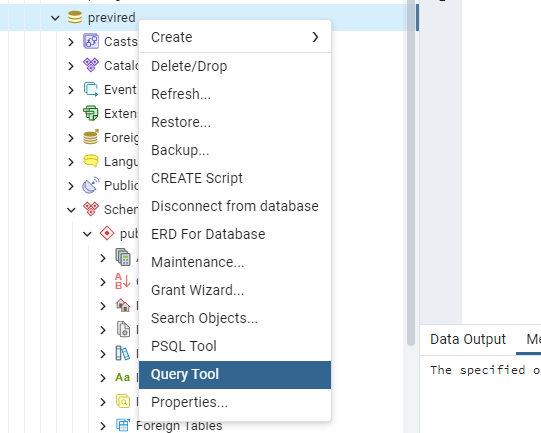
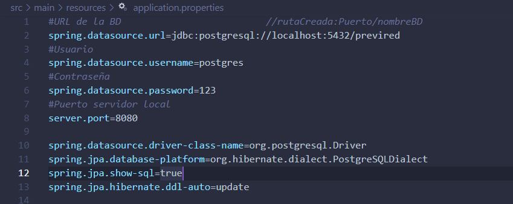
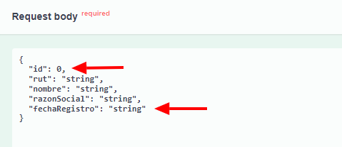
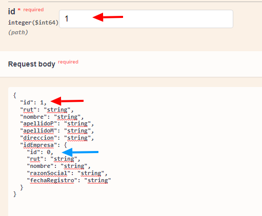
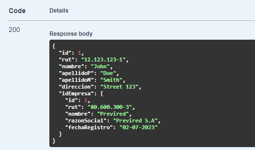

1-Crear servidor postgreSQL, seguidamente crear una base de datos vacía  
 
2-Usar QueryTool para insertar el script que generará la base de datos 
 
3-Insertar el código de script.sql (Ubicado en la carpeta Script), click en ejecutar 
 
4-Editar el archivo "application.properties" dentro de la ruta src/main/resources/ 
  Ajustar los parámetros según las propiedades de la base de datos recién creada 
 
5-Ejecutar el proyecto 
 
6-Ingresar a la url: http://localhost:8080/swagger-ui/index.html#/ (Cambiar el puerto en caso de que sea necesario, por defecto 8080) 
 
 
 
 
NOTAS: 
1-Los siguientes campos son asignados automáticamente: 
	- Fecha de registro (Empresa)  
	- Id (Empresa) 
	- Id (Empleado) 
	 Estos pueden ser dejados tal como estan. 
 

2-Al actualizar un registro, es necesario que el ID enviado en la solicitud PUT coincida con el ID del objeto JSON 

En el ejemplo se actualiza mediante la solicitud PUT (1) al empleado con el ID = 1, asignamos una empresa al empleado (flecha azul)  
 
Solo con escribir el ID de la empresa, el resto de campos se actualizan con los datos correspondientes.  
 

